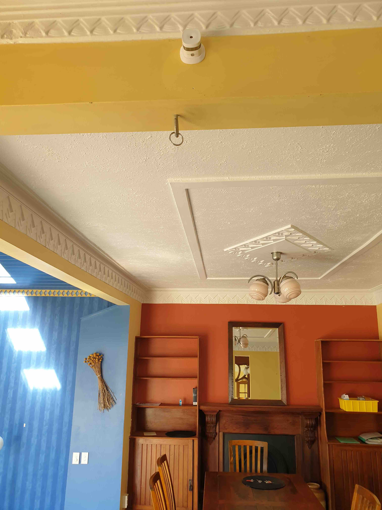

Smoke Alarms (required for RTA):

    I don’t remember spotting these while I was there but if they are installed, please send me a photo
    See details on report for where they need to be

| Workarea         | Location | Checkpoint | Complies |
|------------------|------------| ----------|----------|
| Master Bedroom   | Inside Master Bedroom, above main entrance doors | Alarm Tested | &#x2714; |
| Master Bedroom   | Inside Master Bedroom, above main entrance doors | Expiry Date | &#x2714; |
| Main Living Area | Expiry Date  |     |          |
